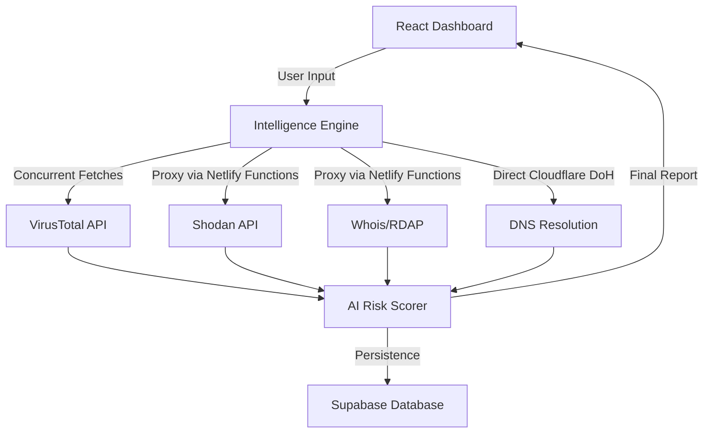

# 🔷 Hex AI - Threat Intelligence Platform

[](https://reactjs.org)
[](https://www.typescriptlang.org)
[](https://netlify.com)

> 🛡️ **A centralized AI-driven Security Information and Event Management (SIEM) dashboard for real-time threat intelligence and vulnerability mapping.**

Hex AI is a professional-grade **Threat Intelligence Platform** designed to correlate disparate security data sources into a single, actionable dashboard. By leveraging advanced AI models and real-time security APIs, Hex AI provides immediate visibility into the risk profile of any IP address or domain.

---

## ✨ Key Features

### 🌍 **Interactive Threat Mapping**
- **Dynamic Geolocation**: Real-time physical location tracking for IP addresses.
- **Domain-to-IP Resolution**: Advanced DNS-over-HTTPS (DoH) logic that resolves domain targets (e.g., `google.com`) to their active edge-server IPs for accurate mapping.
- **SafeMap™ Engine**: A resilient Leaflet implementation with built-in ErrorBoundaries to ensure zero-crash UI performance.

### 🧠 **AI Intelligence & Resilience**
- **3-Stage Fallback System**: To circumvent API rate limits (429 errors), Hex AI automatically cycles through three stages of intelligence:
  1. Primary: Llama-3.3-70B (High Intelligence)
  2. Redundant: Secondary API Key failsafe
  3. Fail-safe: Llama-3.1-8B-Instant (High Availability)
- **Automated Security Reporting**: Instant generation of executive security summaries and actionable recommendations.

### 📡 **Multi-Source Correlation**
- **VirusTotal Integration**: Reputation analysis and malicious detection statistics.
- **Shodan Intelligence**: Real-time discovery of open ports, services, and known vulnerabilities (CVEs).
- **WHOIS/RDAP Analytics**: Domain registrar verification, ownership history, and registration age.
- **Automated Risk Engine**: A proprietary 0-100 scoring algorithm that weights threat vectors in real-time.

---

## 🏗️ Technical Architecture

Hex AI uses a modern, high-performance architecture optimized for security data handling:



### 🛰️ **Proxy Strategy (CORS Bypass)**
To ensure maximum security and bypass browser CORS restrictions, Hex AI utilizes **Netlify Serverless Functions** as secure middleware proxies. This allows the frontend to communicate with protected infrastructure (Shodan, WHOIS) without exposing client-side credentials.

---

## 💻 Tech Stack

- **Frontend**: React 18 + TypeScript + Vite
- **Styling**: Tailwind CSS + Shadcn UI
- **AI Core**: Groq Inference Engine (Llama 3.3/3.1)
- **Mapping**: Leaflet.js
- **Backend & DB**: Supabase (Auth + History)
- **Infrastructure**: Netlify (Hosting + Lambda Functions)

---

## 🚀 Deployment & Setup

### **Environment Variables**
Create a `.env` file in the root directory:
```env
VITE_VIRUSTOTAL_API_KEY=YOUR_KEY
VITE_SHODAN_API_KEY=YOUR_KEY
VITE_SUPABASE_URL=YOUR_URL
VITE_SUPABASE_ANON_KEY=YOUR_KEY
VITE_GROQ_API_KEY=YOUR_KEY
VITE_GROQ_API_KEY_BACKUP=YOUR_BACKUP_KEY
```

### **Local Development**
```bash
npm install
npm run dev
```

### **Production Deployment**
```bash
npm run build
npx netlify deploy --prod
```

---

## ⚖️ Legal Disclaimer

This tool is created for **Educational and Authorized Security Testing** purposes only. Unauthorized access to computer systems is illegal. The developers and contributors of Hex AI are not responsible for any misuse of this platform.

---

**🔒 Threat Intelligence • Autonomous Analysis • Zero-Trust Architectures**

Made with ❤️ for the **Final Major Project Submission**.
